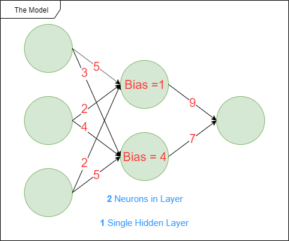
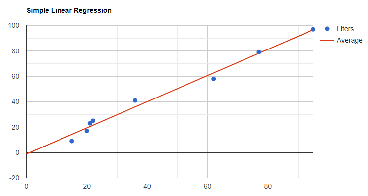
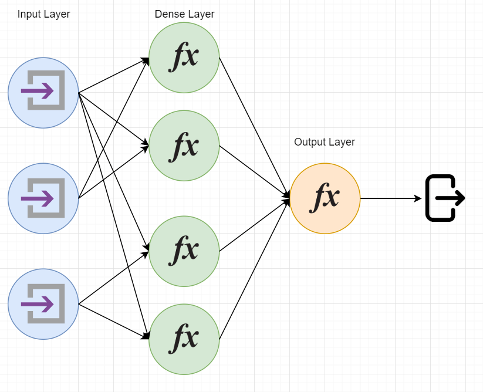

# Kotlin 中的监督学习简介

[算法](https://www.baeldung.com/kotlin/category/algorithms)

- [ ] [Introduction to Supervised Learning in Kotlin](https://www.baeldung.com/kotlin/introduction-to-supervised-learning-in-kotlin#linear-regression)

1. 概述

    监督学习是机器学习的一个子集。它包括使用标注的经验数据来训练机器学习模型。换句话说，就是通过经验收集数据。

    在本教程中，我们将学习如何在 Kotlin 中应用监督学习。我们将学习两种算法，一种简单，一种复杂。在学习过程中，我们还将讨论正确的数据集准备。

2. 算法

    监督学习模型建立在机器学习算法之上。目前存在多种算法。

    让我们先来了解一些一般概念，之后我们将继续介绍一些著名的算法。

    1. 数据集准备

        首先，我们需要一个数据集。完美的数据集是预先标记好的，其特征是相关的，并且经过转换，可以作为模型的输入。

        遗憾的是，完美的数据集并不存在。因此，我们需要准备数据。

        在进行监督学习时，数据准备至关重要。让我们先来看看受[葡萄酒质量数据](https://www.kaggle.com/rajyellow46/wine-quality)集启发而建立的数据集：

        | Type  | Acidity | Dioxide | pH   |
        |-------|---------|---------|------|
        | red   | 0.27    | 45      | 3    |
        | white | 0.3     | 14      | 3.26 |
        |       | 0.28    | 47      | 2.98 |
        | white | 0.18    |         | 3.22 |
        | red   |         | 16      | 3.17 |

        首先，我们来处理数据集中的缺失单元格。有多种技术可以处理数据集中的缺失数据。

        例如，在我们的案例中，我们将删除包含缺失的葡萄酒类型的行，因为类型在这里很重要，因为它有助于解释其他特征。另一方面，我们还将用现有特征值的平均值来替换缺失的数值：

        | Type  | Acidity | Dioxide | pH   |
        |-------|---------|---------|------|
        | red   | 0.27    | 45      | 3    |
        | white | 0.3     | 14      | 3.26 |
        | white | 0.18    | 31      | 3.22 |
        | red   | 0.26    | 16      | 3.17 |

        为了清楚起见，我们还确保四舍五入，尊重列的小数精度。

        其次，我们继续将"白色"和 "红色"这两个类别转换成数值。我们将这一特征视为分类特征。至于缺失数据，有多种技术适用于分类数据。

        在我们的例子中，如前所述，我们将用数值来代替数值：

        | Type | Acidity | Dioxide | pH   |
        |------|---------|---------|------|
        | 0    | 0.27    | 45      | 3    |
        | 1    | 0.3     | 14      | 3.26 |
        | 1    | 0.18    | 31      | 3.22 |
        | 0    | 0.26    | 16      | 3.17 |

        准备数据集的最后一步是特征缩放。要说明的是，特征缩放是将多个特征放在同一数值范围内的过程，通常是 [0, 1] 或 [-1, 1]。

        以我们的数据集为例，我们将使用最小-最大缩放。

        最小-最大缩放是一种技术，包括创建一个从特定列的最小值到最大值的缩放比例。

        例如，在"二氧化物"一栏中，最小值 14 将变为 0，47 将变为 1。因此，所有其他值都将介于两者之间：

        | Type | Acidity | Dioxide | pH   |
        |------|---------|---------|------|
        | 0    | 0.75    | 0.94    | 0.07 |
        | 1    | 1       | 0       | 1    |
        | 1    | 0       | 0.52    | 0.86 |
        | 0    | 0.67    | 0.06    | 0.68 |

        最后，既然数据集已经准备就绪，我们就可以集中精力研究模型了。

    2. 模型

        模型是接收数据集输入并产生输出的算法。

        让我们以人工神经网络为例，通过一些例子来解释接下来的概念：

        

        在研究机器学习模型时，我们往往会提到不同种类的参数。它们在模型的训练过程中不断演变，以适应模型应该具有的最佳行为。例如，我们会考虑在训练过程中调整输入数据的乘法器。图中的红色值代表了一些可能的参数。

        其他类型的参数称为超参数。图中的蓝色值表示一些可能的超参数。这些参数是在训练期之前定义的。例如，我们可以考虑人工神经网络所需的神经元数量。另一种超参数是使用何种激活函数或损失函数。

        现在我们来看看两种机器学习算法：线性回归和人工神经网络。

    3. 线性回归

        线性回归，顾名思义，是一种回归算法。它有多种变体：

        - 简单线性回归是用一个标量变量解释另一个标量变量。例如，房子的价格可以用平方英尺数来解释。
        - 多元线性回归也是解释一个标量变量。不过，这次输入的不是一个变量，而是多个变量。同样是预测房屋价格，我们将考虑更多变量，如房间数、浴室数、学校距离和公共交通选择。
        - 多项式线性回归解决的问题与多元线性回归相同，但它得出的预测结果不会不断变化。例如，住房价格可以呈指数上升，而不是不断变化。
        - 最后，一般线性模型可以同时解释多个变量，而不是一个变量。

        还有其他类型的线性回归，但并不常见。

        简单地说，线性回归是利用数据集（蓝点）并通过它们投射出一条合理的直线（红线），以便根据新数据进行推断：

        

    4. 人工神经网络

        人工神经网络是更为复杂的机器学习算法。

        它们由一层或多层人工神经元组成，每层由一个或多个神经元组成。神经元是数学函数，接受输入并将输出前馈给其他神经元或最终输出。

        前馈完成后，执行反向传播以修正函数的变量。反向传播可以降低模型的成本，提高模型的准确性和精确度。这是通过使用训练数据集的训练期来实现的。

        ANN 可用于解决回归和分类问题。例如，它们通常擅长图像识别、语音识别、医疗诊断或机器翻译。

        我们可以直观地看到，人工神经网络由输入和输出神经元以及隐藏的神经元层（也称为密集层）组成：

        

3. 使用原生 Kotlin 的演示

    首先，我们来看看如何用 Kotlin 或其他语言原生创建一个模型。让我们以简单线性回归为例。

    提醒一下，简单线性回归是使用自变量预测因变量的模型。例如，它可以根据孩子的数量预测一个家庭所需的牛奶量。

    1. 公式

        让我们来看看简单线性回归的公式以及如何得到所需变量的值：

        ```code
        # Variance 方差
        variance = sumOf(x => (x - meanX)²)
        # Covariance 协方差
        covariance = sumOf(x, y => (x - meanX) * (y - meanY))
        # Slope 斜率
        slope = coveriance / variance
        # Y Intercept Y 截距
        yIntercept = meanY - slope x meanX
        # Simple Linear Regression 简单线性回归
        dependentVariable = slope x independentVariable + yIntercept
        ```

    2. 公式的 Kotlin 实现

        现在，让我们把这个伪代码转换为 Kotlin，并使用一个数据集来表示每一年工作经验的工资中位数（单位：千）：

        ```kotlin
        // Dataset
        val xs = arrayListOf(1, 2, 3, 4, 5, 6, 7, 8, 9, 10)
        val ys = arrayListOf(25, 35, 49, 60, 75, 90, 115, 130, 150, 200)
        // Variance
        val variance = xs.sumByDouble { x -> (x - xs.average()).pow(2) }
        // Covariance
        val covariance = xs.zip(ys) { x, y -> (x - xs.average()) * (y - ys.average()) }.sum()
        // Slope
        val slope = covariance / variance
        // Y Intercept
        val yIntercept = ys.average() - slope * xs.average()
        // Simple Linear Regression
        val simpleLinearRegression = { independentVariable: Int -> slope * independentVariable + yIntercept }
        ```

        现在我们已经建立了一个模型，可以用它来预测数值。例如，拥有 2.5 年或 7.5 年工作经验的人应该获得多少收入？让我们来测试一下：

        ```kotlin
        val twoAndAHalfYearsOfExp = simpleLinearRegression.invoke(2.5) // 38.99
        val sevenAndAHalfYearsOfExp = simpleLinearRegression.invoke(7.5) // 128.84
        ```

    3. 评估结果

        结果似乎符合预期行为。但是，我们该如何评估这条语句呢？

        我们将使用损失函数（本例中为 R²）来计算工作年限对因变量薪资的解释程度：

        ```code
        # SST
        sst = sumOf(y => (y - meanY)²)
        # SSR
        ssr = sumOf(y => (y - prediction)²)
        # R²
        r² = (sst - ssr) / sst
        ```

        在 Kotlin 中

        ```kotlin
        // SST
        val sst = ys.sumByDouble { y -> (y - ys.average()).pow(2) }
        // SSR
        val ssr = xs.zip(ys) { x, y -> (y - simpleLinearRegression.invoke(x.toDouble())).pow(2) }.sum()
        // R²
        val rsquared = (sst - ssr) / sst
        ```

        最后，我们得到了 0.95 的 R²，这意味着工作年限对员工工资的解释准确率达到了 95%。因此，这无疑是一个很好的预测模型。其他变量可以是谈判技巧或证书数量等，以解释剩余的 5%。也可能只是随机因素。

4. 使用 Deeplearning4j 的演示

    在本演示中，我们将使用 [Zalando MNIST](https://github.com/zalandoresearch/fashion-mnist) 数据集来训练卷积神经网络。该数据集由 28×28 幅鞋、包和其他八种服装的图像组成。

    1. Maven 依赖项

        首先，我们将在简单的 maven Kotlin 项目中添加 [Deeplearning4j](https://mvnrepository.com/artifact/org.deeplearning4j/deeplearning4j-core) 依赖项：

        ```xml
        <dependency>
            <groupId>org.deeplearning4j</groupId>
            <artifactId>deeplearning4j-core</artifactId>
            <version>1.0.0-beta5</version>
        </dependency>
        ```

        另外，让我们添加 [nd4j](https://mvnrepository.com/artifact/org.nd4j/nd4j-native-platform) 依赖关系。ND4J 提供了执行多维矩阵计算的 API：

        ```xml
        <dependency>
            <groupId>org.nd4j</groupId>
            <artifactId>nd4j-native-platform</artifactId>
            <version>1.0.0-beta5</version>
        </dependency>
        ```

    2. 数据集

        既然已经添加了所需的依赖项，我们就来下载并准备数据集。[Zalando MNIST GitHub](https://github.com/zalandoresearch/fashion-mnist) 页面提供了该数据集。我们将通过在像素向量末尾添加标签来准备数据集：

        cnn/ZalandoMNISTDataSet.kt: `fun load(): MutableList<List<String>>`

    3. 构建人工神经网络

        现在让我们构建神经网络。为此，我们需要：

        - 多个卷积层 - 这些层已被证明是图像识别的最佳层。事实上，以区域为单位而不是以像素为单位的工作方式可以更好地识别形状。
        - 与卷积层一起使用的汇集层--汇集层用于将从卷积层接收到的不同汇集值汇集到单个单元中
        - 多个批量归一化层，通过归一化不同层（无论是卷积层还是简单的前馈神经元层）的输出，避免过度拟合
        - 多个常规前馈神经元层，连接最后一个卷积层的输出和神经网络模型

        cnn/ConvolutionalNeuralNetwork.kt: `private fun buildCNN(): MultiLayerNetwork`

    4. 训练模型

        现在我们已经准备好了模型和数据集。我们还需要一个训练例程：

        ```kotlin
        private fun learning(cnn: MultiLayerNetwork, trainSet: RecordReaderDataSetIterator) {
            for (i in 0 until 10) {
                cnn.fit(trainSet)
            }
        }
        ```

    5. 测试模型

        此外，我们还需要一段代码来根据测试数据集测试模型：

        ```kotlin
        private fun testing(cnn: MultiLayerNetwork, testSet: RecordReaderDataSetIterator) {
            val evaluation = Evaluation(10)
            while (testSet.hasNext()) {
                val next = testSet.next()
                val output = cnn.output(next.features)
                evaluation.eval(next.labels, output)
            }
            println(evaluation.stats())
            println(evaluation.confusionToString())
        }
        ```

    6. 运行监督学习

        最后，我们可以一个接一个地调用所有这些方法，看看模型的性能如何：

        ```kotlin
        val dataset = getDataSet()
        dataset.shuffle()
        val trainDatasetIterator = createDatasetIterator(dataset.subList(0, 50_000))
        val testDatasetIterator = createDatasetIterator(dataset.subList(50_000, 60_000))

        val cnn = buildCNN()
        learning(cnn, trainDatasetIterator)
        testing(cnn, testDatasetIterator)
        ```

    7. 结果

        最后，经过几分钟的训练后，我们就能看到模型的表现了：

5. 结论

    我们已经了解了如何使用 Kotlin 监督学习来训练机器学习模型。我们使用 Deeplearning4j 来帮助我们处理复杂的算法。简单的算法甚至不需要任何库就可以原生实现。

## Code

像往常一样，源代码可在 [GitHub](https://github.com/Baeldung/kotlin-tutorials/tree/master/machine-learning) 上获取。
